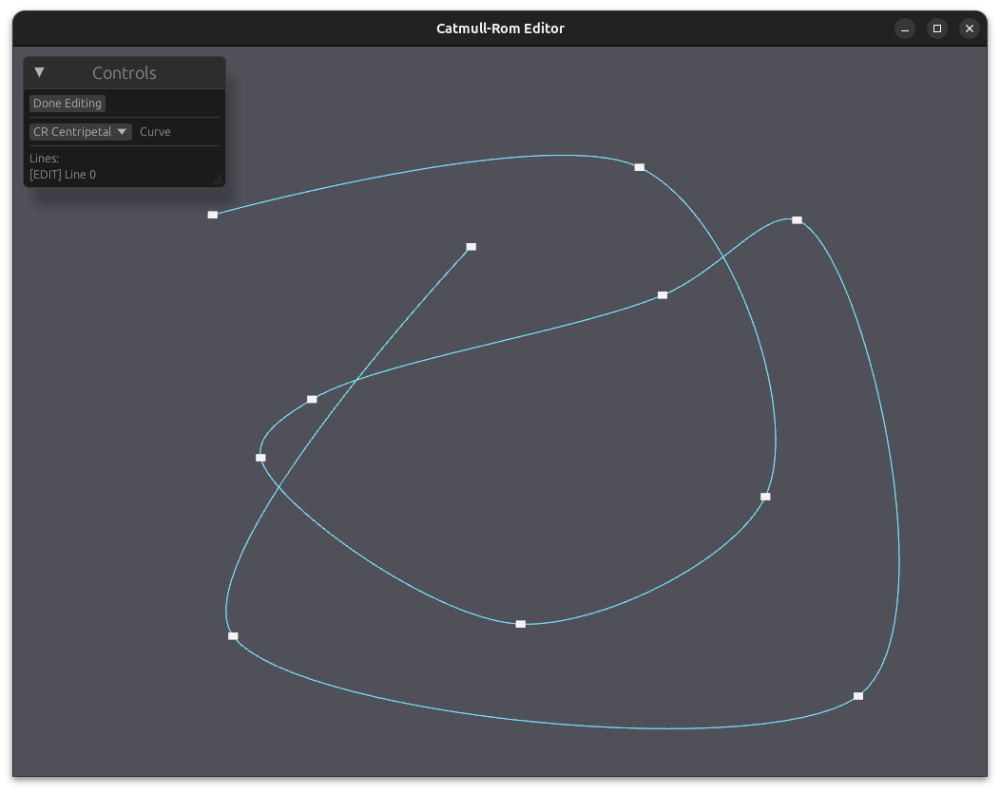

# curve-editor-sample

An interactive spline curve editor built with Rust, wgpu, and egui.



## Features

- Draw and edit multiple spline curves on a canvas
- Three curve types:
  - **Catmull-Rom** — uniform parametrization
  - **Catmull-Rom Centripetal** — prevents cusps and self-intersections
  - **B-Spline Interpolating** — cubic B-spline that passes through all control points
- Drag control points to reshape curves in real time
- Right-click a control point to delete it

## Usage

| Action | Input |
|---|---|
| Add control point | Left-click on canvas (while editing) |
| Move control point | Left-drag |
| Delete control point | Right-click → Delete Point |
| Create new curve | Click **New Line** in the Controls panel |
| Select curve to edit | Click its name in the Controls panel |
| Finish editing | Click **Done Editing** |

## Build

### Native

```sh
cargo run
```

Requires a GPU with Vulkan, Metal, or DX12 support (via wgpu).

### Web (WebGL2)

Requires [trunk](https://trunkrs.dev/).

```sh
cargo install trunk
trunk serve
```

Open http://localhost:8080 in your browser.

For a production build, run `trunk build` — output goes to `dist/`.
